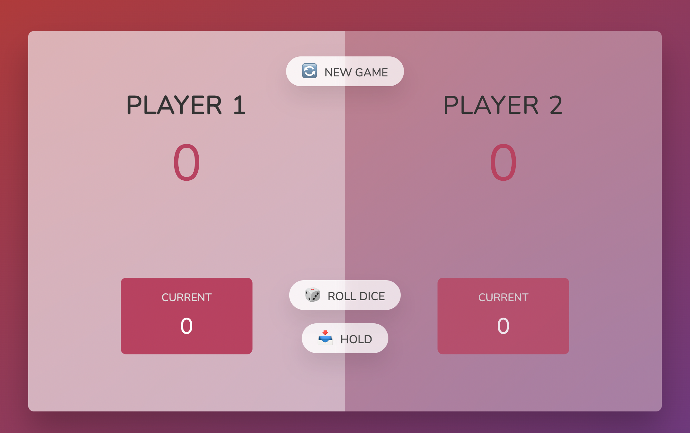
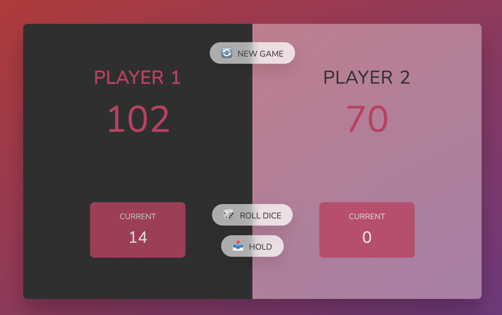

# Pig-Game

  🐖 Pig game is a 2-player game. 

  🎮 Players roll the dice, as they continue rolling their scores go up until they have 1. When they get 1, their current scores will be lost so they have to save their current scores before they get 1 (and they give their turn) 
  
  🥳 The first player to reach 100 wins!

  📊 Here is a flowchart for the game:  
  

Here is how the game looks:

Herw is how it looks when someone wins:

